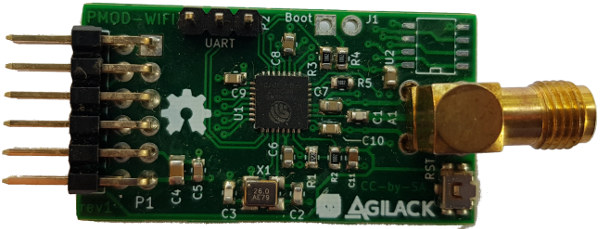
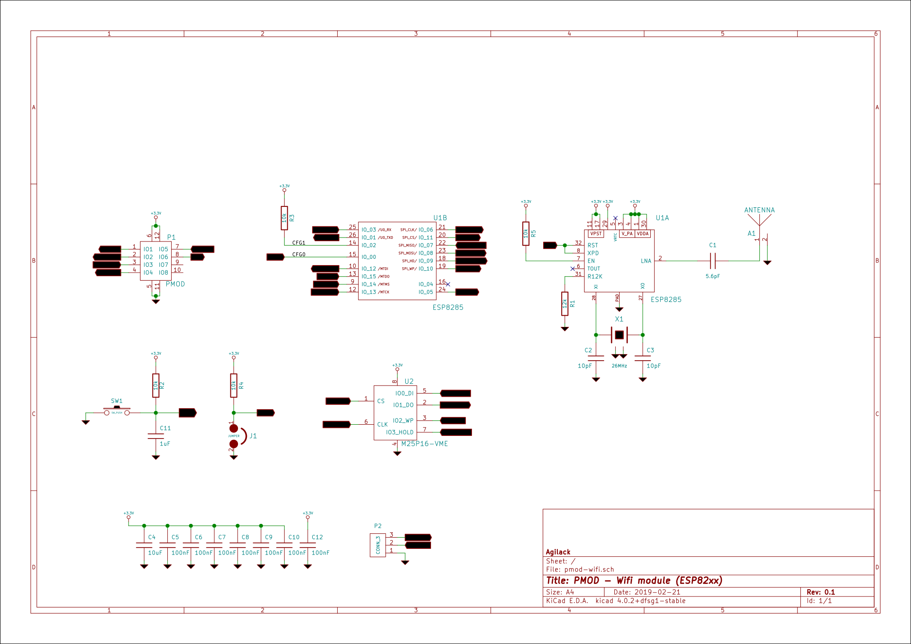

PMOD Wifi
=========

This PMOD peripheral allow to quickly add a Wifi interface to a development
board. The embedded espressif chip (ESP8285 or ESP8266) can act as a station
(client) or as an access point (AP).

The PMOD connector use a type 4A interface (UART 12 pins).

Design
------

            Schematics            |              Routing
--------------------------------- | ---------------------------------
 | 
